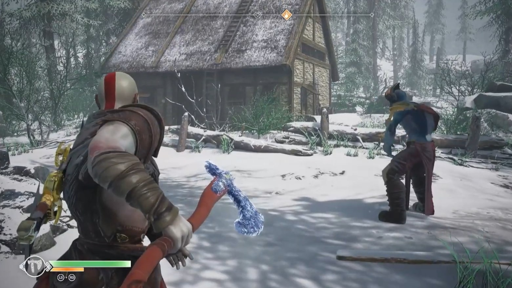
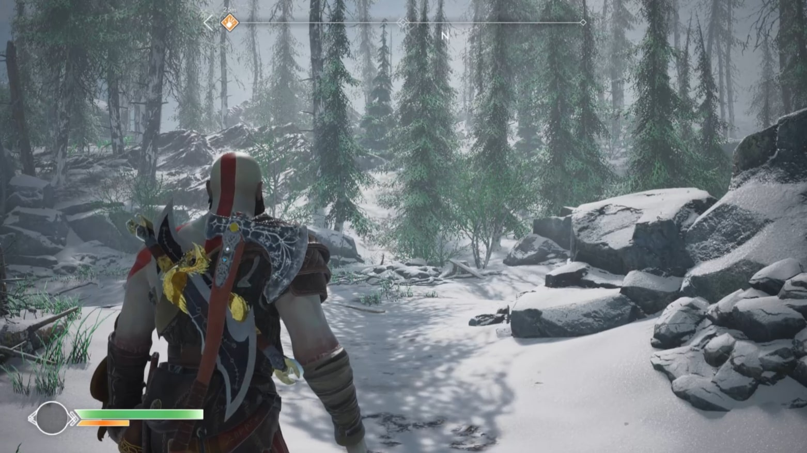
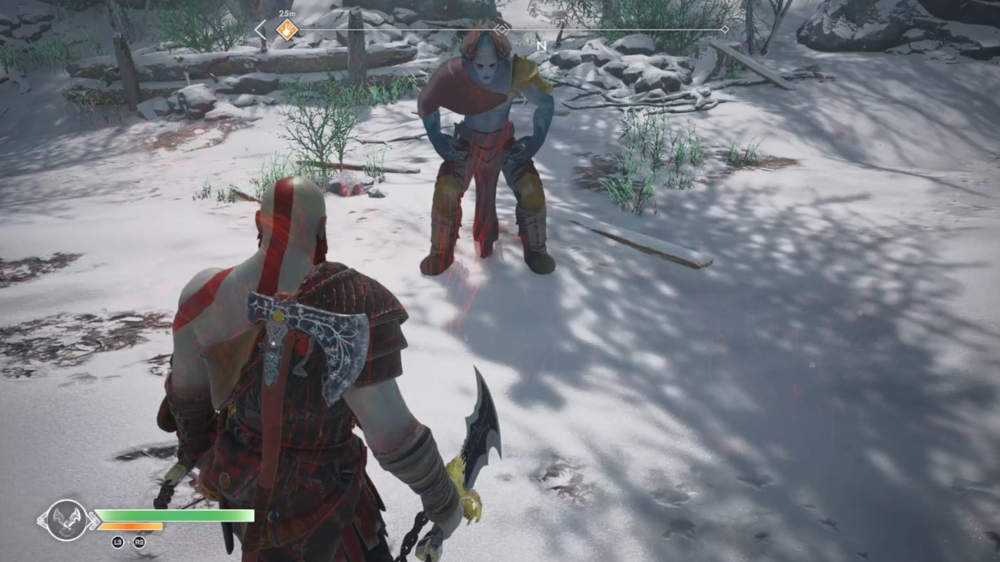
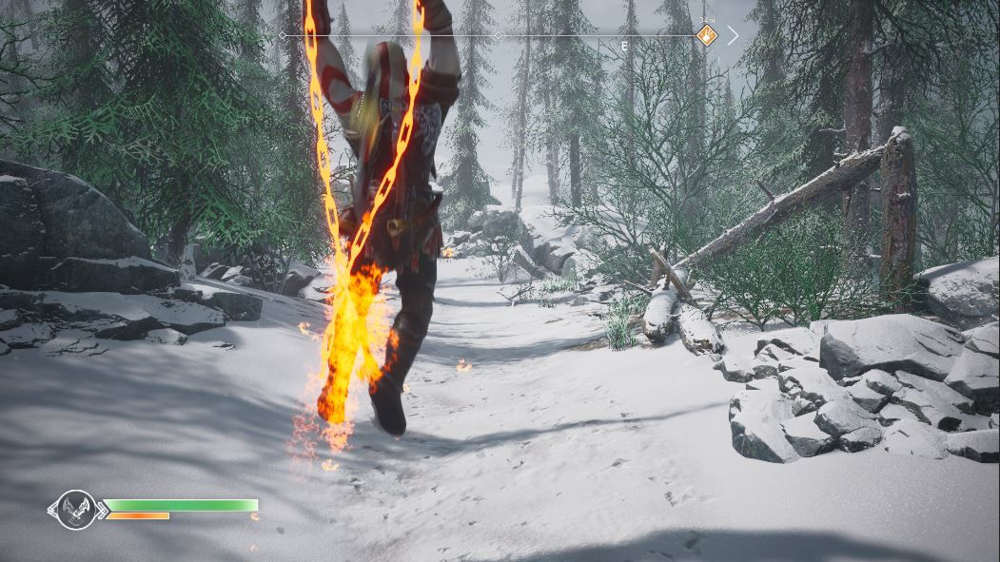
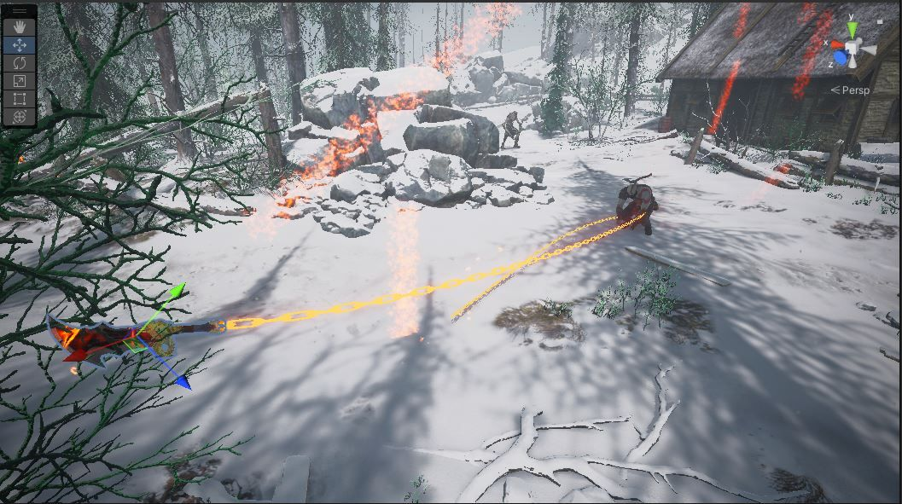

# God-of-War---Demo
Developing various logics like dynamic UI, 2D animations blend-trees, and animation warping through code. Primitive logic implementations like locking target enemies, manipulating dynamic material parameters, and cross-input compatibility. An intense environment-level design using HQ FX, particle systems, and assets.

## Motivation
Passionate personal project on Unity by recreating and implementing my favourite game God of War made by by Sony. 
See the project in action here => https://youtube.com/playlist?list=PLCXXIoh9PICVRkcEoioSvlrBOGwOmYIwi

## Screenshots

## License
[MIT](https://choosealicense.com/licenses/mit/)
